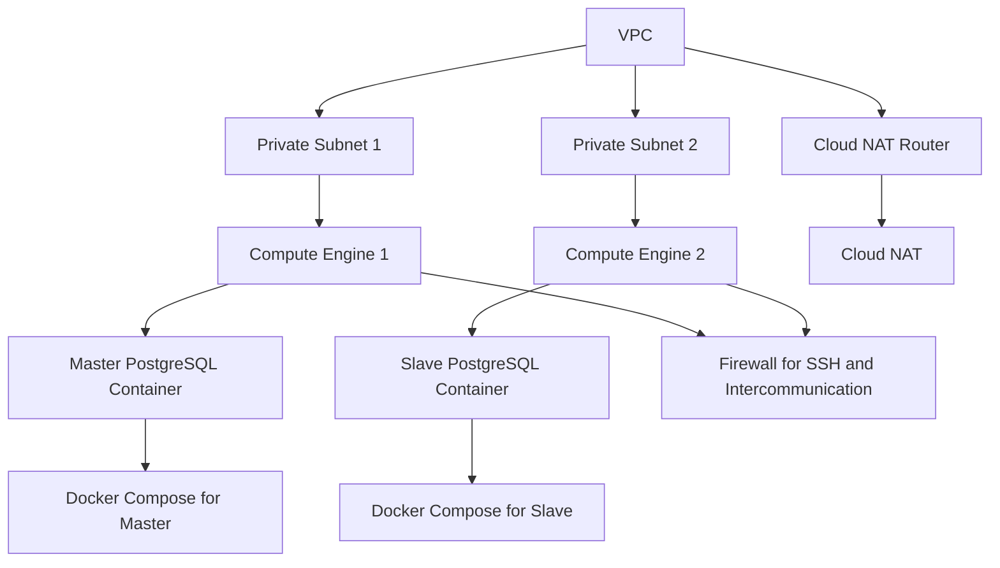

# PostgreSQL Repository Documentation

## Overview

This repository contains the source code and resources for managing a PostgreSQL database. It includes scripts, configuration files, and documentation to help you set up, maintain, and optimize your PostgreSQL database.

## Architecture Diagram

Below is a diagram illustrating the components included in this repository:



- **Compute Engine in Private Subnet 1**: Hosts the master PostgreSQL container.
- **Compute Engine in Private Subnet 2**: Hosts the slave PostgreSQL container.
- **Cloud NAT**: Established with a Cloud NAT router for internet access.
- **Firewall**: Configured for SSH access and intercommunication between PostgreSQL servers.
- **Docker Compose Files**: Separate files for master and slave PostgreSQL containers on different servers.

## Features

- **Database Setup**: Scripts to initialize and configure a PostgreSQL database.
- **Backup and Restore**: Tools to create backups and restore the database.
- **Performance Tuning**: Configuration files and guidelines for optimizing database performance.
- **Monitoring**: Scripts and tools for monitoring database health and performance.

## Getting Started

To get started with this repository, follow these steps:

1. Clone the repository:
    ```sh
    git clone https://github.com/yourusername/postgres.git
    ```
2. Navigate to the repository directory:
    ```sh
    cd postgres
    ```


## Contributing

We welcome contributions! 

## License

This project is licensed under the MIT License. See the `LICENSE` file for more details.

## Contact

For any questions or issues, please open an issue in the repository or contact the maintainers.
